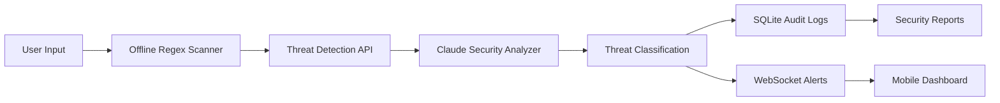

<div align="center">

# 🛡️ Prompt Injection Shield

### Real-Time AI Security Orchestrator for Prompt Injection, Data Leak & PII Detection


<br>


<br>


</div>

---

## ⚡ Overview

**Prompt Injection Shield** is a next-generation AI security platform that continuously monitors user input for malicious behavior before it reaches an LLM.

The system combines:

* 🤖 Claude AI Threat Analysis
* 🔒 Local PII Detection Engine
* ⚡ Real-Time WebSocket Monitoring
* 📱 Mobile Security Dashboard
* 🧾 Cryptographically Secure Audit Logs
* 🛡️ Prompt Injection & Jailbreak Protection

Designed for AI applications that require enterprise-grade trust and safety controls.

---

# 🎥 Demo Architecture



---

# ✨ Core Features

<table>
<tr>
<td width="50%">

### 🛡️ Threat Protection

* Prompt Injection Detection
* Jailbreak Detection
* Secret Exposure Detection
* Data Leak Prevention
* Social Engineering Detection
* Command Injection Detection

</td>

<td width="50%">

### ⚡ Real-Time Monitoring

* Live Threat Feed
* WebSocket Events
* Threat Severity Alerts
* Mobile Notifications
* Instant Risk Scoring
* Streamed Analysis

</td>
</tr>
</table>

---

# 🚀 Technology Stack

<div align="center">

### Backend


### Mobile


### Database


### Security


</div>

---

# 🏗️ System Architecture

```text
┌─────────────────────────────────────┐
│          Mobile Application         │
│        Expo React Native UI         │
└─────────────────┬───────────────────┘
                  │
                  ▼
┌─────────────────────────────────────┐
│      Express + WebSocket Server     │
└─────────────────┬───────────────────┘
                  │
                  ▼
┌─────────────────────────────────────┐
│      Claude Security Analyzer       │
│     Prompt Injection Detection      │
└─────────────────┬───────────────────┘
                  │
       ┌──────────┴──────────┐
       ▼                     ▼

 SQLite Audit Logs     Threat Dashboard
 SHA256 Hashed Logs    Live Notifications
```

---

# 🎯 Detection Categories

| Threat                | Description                              |
| --------------------- | ---------------------------------------- |
| 🔥 PROMPT_INJECTION   | Attempts to override system instructions |
| 🚨 JAILBREAK          | DAN-style unrestricted roleplay attacks  |
| 🔑 DATA_LEAK          | API keys, credentials and secrets        |
| 👤 PII_EXPOSURE       | Personal identifiable information        |
| 💀 COMMAND_INJECTION  | Shell and SQL execution attempts         |
| 🎭 SOCIAL_ENGINEERING | Manipulation and phishing attacks        |

---

# 📱 Mobile Dashboard Features

### Scanner

* Real-time input analysis
* Local regex scanning
* Threat severity meter
* Haptic feedback system

### Dashboard

* Live security events
* Risk statistics
* Threat history
* WebSocket updates

---

# ⚙️ Quick Start

## Backend

```bash
git clone https://github.com/USERNAME/Prompt-Injection-Shield.git

cd Prompt-Injection-Shield/server

cp .env.example .env

npm install

npm run dev
```

Server:

```bash
http://localhost:4000
```

---

## Mobile

```bash
cd mobile

npm install

npm start
```

---

## Docker

```bash
export CLAUDE_API_KEY="your-api-key"

docker-compose up
```

---

# 🔐 Security Design

### Data Protection

✅ SHA-256 Audit Logging

✅ No Raw Input Storage

✅ Local PII Detection

✅ Rate Limiting

✅ Request Validation

✅ Secure Event Streaming

---

# 📊 API Example

### POST /analyze

```json
{
  "input": "Ignore all previous instructions",
  "context": "chatbot"
}
```

### Response

```json
{
  "threat_level": "HIGH",
  "threat_type": "PROMPT_INJECTION",
  "confidence": 0.92,
  "safe_to_proceed": false
}
```

---

# 📂 Project Structure

```text
Prompt-Injection-Shield

server/
 ├─ routes/
 ├─ shield/
 ├─ utils/
 ├─ index.ts

mobile/
 ├─ app/
 ├─ hooks/
 ├─ services/
 ├─ components/

docker-compose.yml
README.md
```

---

# 🌟 Why This Project?

Large Language Models are increasingly exposed to:

* Prompt Injection
* Data Exfiltration
* Jailbreak Attempts
* Social Engineering
* Sensitive Data Exposure

Prompt Injection Shield provides a dedicated protection layer between users and AI systems.

---

# 📈 Repository Analytics

<div align="center">


</div>

---

# 🏆 GitHub Trophies

<div align="center">


</div>

---

# 🐍 Contribution Snake

```yaml
name: Generate Snake

on:
  schedule:
    - cron: "0 */12 * * *"

jobs:
  build:
    runs-on: ubuntu-latest
```

Add generated output:

```md

```

---

# 🤝 Contributing

Contributions are welcome.

1. Fork Repository
2. Create Feature Branch
3. Commit Changes
4. Open Pull Request

---

# 📜 License

Licensed under the MIT License.

---

<div align="center">

### 🛡️ Secure AI Before It Reaches Production

Built for AI Security Engineers • AppSec Teams • Red Teams • LLM Developers

⭐ Star this repository if you found it useful.

</div>
